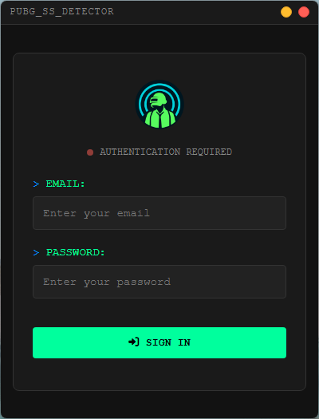
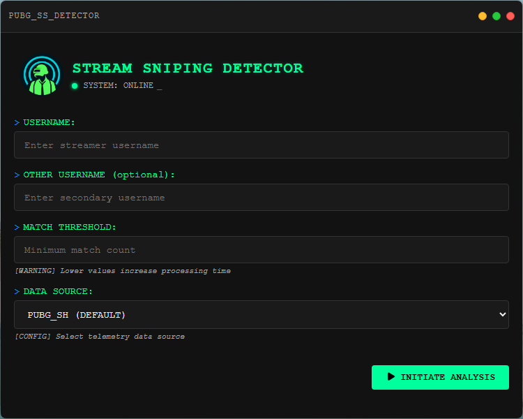
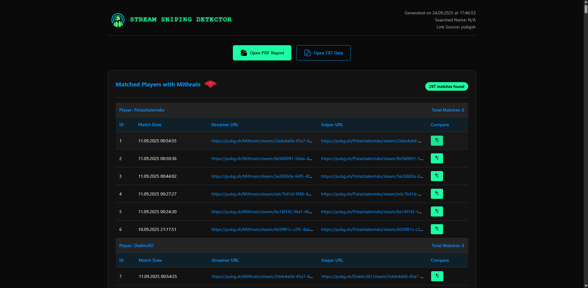
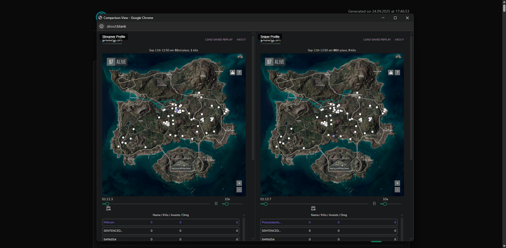

<h1 align="center">
   PUBG Stream Sniping Detector
   
   
</h1>

  <a href="#introduction">Introduction</a> •
  <a href="#screenshots">Screenshots</a> •
  <a href="#developer-contact-information">Developer Contact Information</a>

## ℹ️ Introduction 

This application is designed to help players of PUBG (PlayerUnknown's Battlegrounds) detect potential stream snipers. Stream sniping is a form of cheating where players watch a live stream of another player to gain an unfair advantage in the game.

- You can export the all match data to a JSON file.
- You can export the all match data to a PDF file.
- You can compare two different players' match data.

> [!Important]  
  This application does **not** run in real time; it only displays match history data retrieved from the PUBG API.

### ⚙️**Installation **

1. Go to the [releases](https://github.com/Ctere1/pubgSS/releases) page and download the latest version.
2. Run the application:

    - Double-click `PUBG.Stream.Sniping.Detector.Setup.exe`.
    - Follow the installation prompts to complete the setup.
  
3. After installation, you can launch the application from your desktop or start menu.

> [!Note]  
 > Demo account is provided for testing purposes. You can use the following credentials:  
  > Username: `demo@ss-detector.com`  
  > Password: `Wu9LYm2W5pgyyPuRgCMi`  

## 📸**Screenshots ** 

- The following screenshots show the application's interface and features.

 |                                                |                                                |
 | :--------------------------------------------: | :--------------------------------------------: |
 |  |  |
 |  |  |

### 📜**Developer Contact Information ** 

