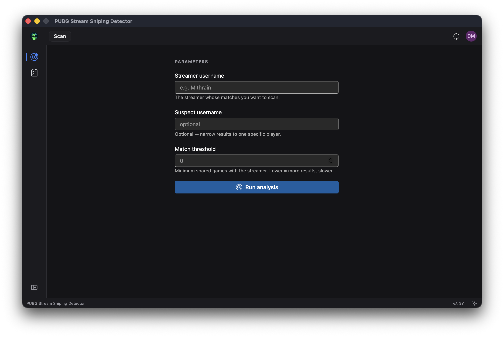
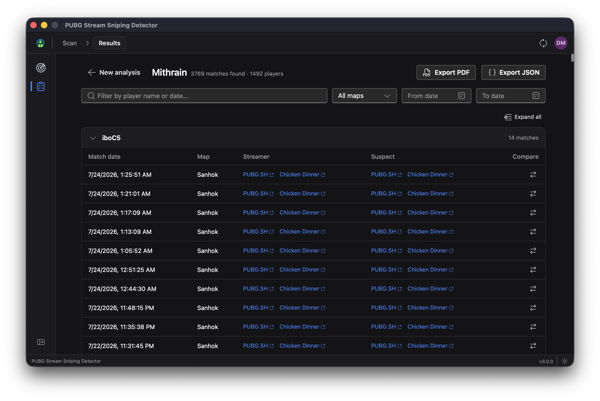
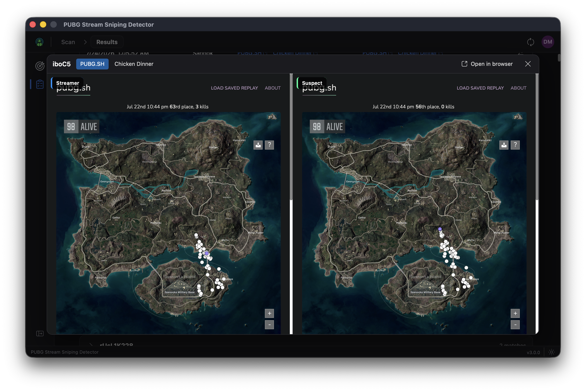
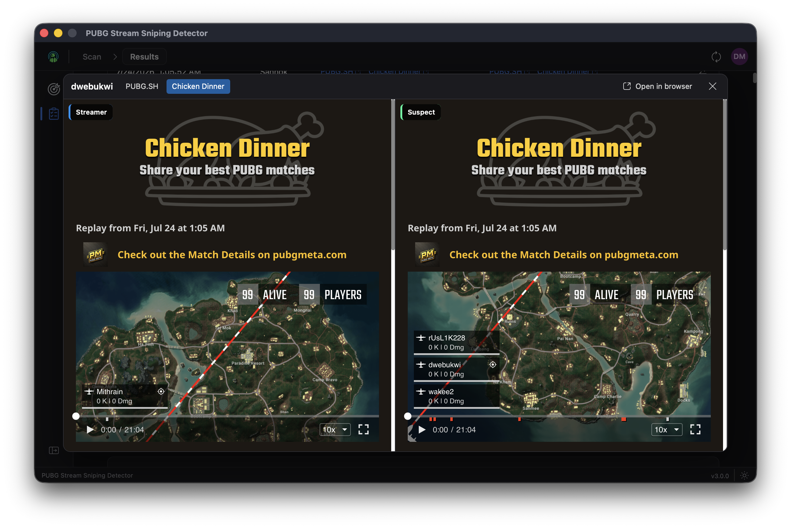

<h1 align="center">
   PUBG Stream Sniping Detector
</h1>

<p align="center">
  <a href="#introduction">Introduction</a> •
  <a href="#installation">Installation</a> •
  <a href="#support-the-project">Support the Project</a> •
  <a href="#screenshots">Screenshots</a> •
  <a href="#website">Website</a> •
  <a href="#developer-contact-information">Developer Contact Information</a>
</p>

<p align="center">
  <a href="https://ctere1.github.io/pubgSS/">ctere1.github.io/pubgSS</a>
</p>

## ℹ️ Introduction <a name="introduction"></a>

This application is designed to help players of PUBG (PlayerUnknown's Battlegrounds) detect potential stream snipers. Stream sniping is a form of cheating where players watch a live stream of another player to gain an unfair advantage in the game.

- You can export the all match data to a JSON file.
- You can export the all match data to a PDF file.
- You can compare two different players' match data.

> [!Important]  
  This application does **not** run in real time; it only displays match history data retrieved from the PUBG API.

### ⚙️**Installation <a name="installation"></a>**

1. Go to the [Releases](https://github.com/Ctere1/pubgSS/releases) page and download the latest version.
2. Run the application: double-click `pubg-stream-sniping-detector.exe`. No installation is required.
3. Enter a player name to pull their recent match history.

## ❤️ Support the Project

PUBGSS is developed and maintained in my spare time.

If this project saves you time or improves your experience, please consider sponsoring its development.

Your support helps fund:
- 🚀 New features
- 🐛 Bug fixes
- 📦 Regular updates
- 🛠️ Long-term maintenance

👉 Sponsor on GitHub: https://github.com/sponsors/Ctere1

## 📸**Screenshots <a name="screenshots"></a>** 

- The following screenshots show the application's interface and features.

 |                                           |                                           |
 | :---------------------------------------: | :---------------------------------------: |
 |  |  |
 |  |  |

## 🌐 Website <a name="website"></a>

The landing page in this repository is a React + Vite single page app, styled with
Tailwind CSS and localised in six languages (EN, TR, DE, FR, ES, KO). It is published
to GitHub Pages by [`.github/workflows/deploy.yml`](.github/workflows/deploy.yml) on
every push to `master`.

```bash
npm install     # install dependencies
npm run dev     # local dev server at http://localhost:5173/pubgSS/
npm run build   # production build into dist/
npm run preview # serve the production build
```

The favicons in `public/` are generated from the master artwork in
`brand/app-icon-1024.png` (which is not deployed):

```bash
cd public
sips -s format png -z 32 32   ../brand/app-icon-1024.png --out favicon-32.png
sips -s format png -z 192 192 ../brand/app-icon-1024.png --out favicon-192.png
sips -s format png -z 180 180 ../brand/app-icon-1024.png --out apple-touch-icon.png
sips -s format png -z 64 64   ../brand/app-icon-1024.png --out icon-64.png
```

### 📜**Developer Contact Information <a name="developer-contact-information"></a>** 

<a href = "mailto:cemiltan896@gmail.com"></a>
<a href = "https://github.com/Ctere1"></a>