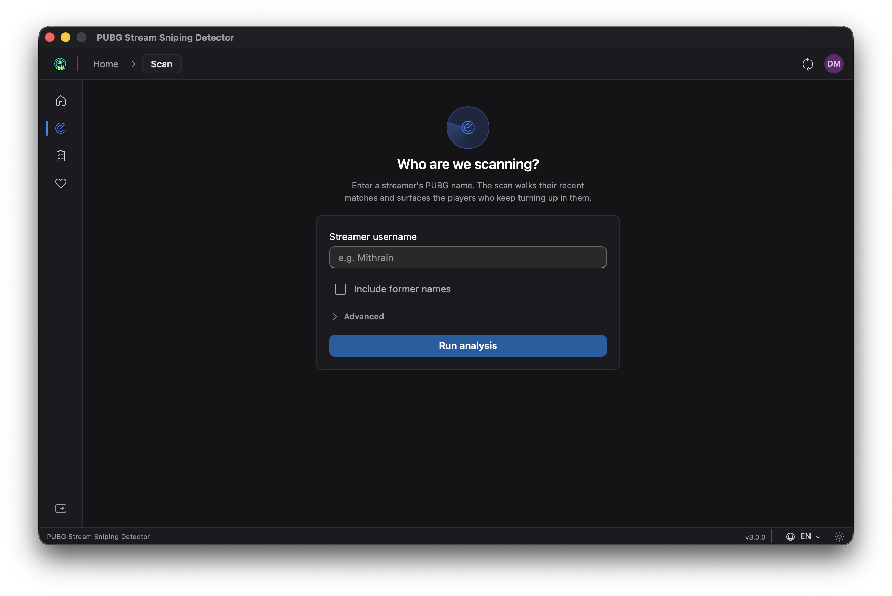
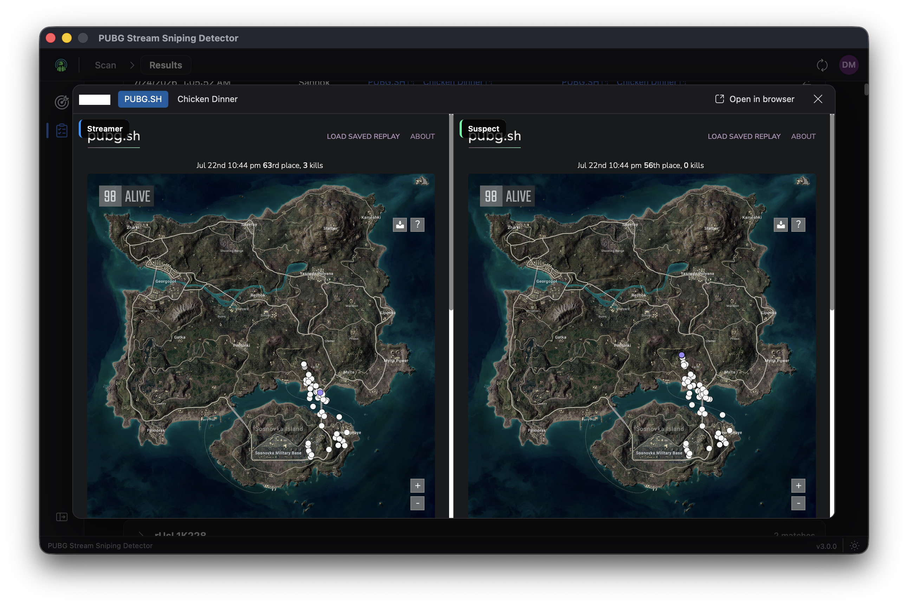
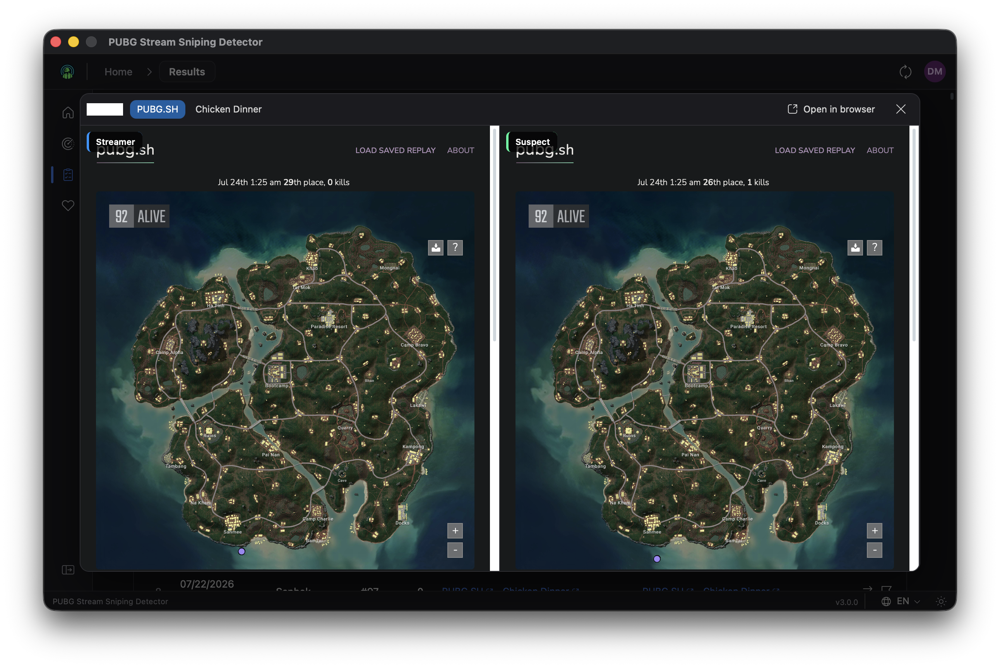

<h1 align="center">
   
  PUBG Stream Sniping Detector
</h1>

  <a href="#introduction">Introduction</a> •
  <a href="#installation">Installation</a> •
  <a href="#support-the-project">Support the Project</a> •
  <a href="#screenshots">Screenshots</a> •
  <a href="#license">License</a> •
  <a href="#developer-contact-information">Developer Contact Information</a>

  <a href="https://ctere1.github.io/pubgSS/">ctere1.github.io/pubgSS</a>

## ℹ️ Introduction 

This application is designed to help players of PUBG (PlayerUnknown's Battlegrounds) detect potential stream snipers. Stream sniping is a form of cheating where players watch a live stream of another player to gain an unfair advantage in the game.

- You can export the all match data to a JSON file.
- You can export the all match data to a PDF file.
- You can compare two different players' match data.

> [!Important]  
  This application does **not** run in real time; it only displays match history data retrieved from the PUBG API.

### ⚙️**Installation **

1. Go to the [Releases](https://github.com/Ctere1/pubgSS/releases) page and download the latest version.
2. Run the application: double-click `pubg-stream-sniping-detector.exe`. No installation is required.
3. Enter a player name to pull their recent match history.

## ❤️ Support the Project

PUBGSS is developed and maintained in my spare time.

If this project saves you time or improves your experience, please consider sponsoring its development.

Your support helps fund:
- 🚀 New features
- 🐛 Bug fixes
- 📦 Regular updates
- 🛠️ Long-term maintenance

👉 Sponsor on GitHub: https://github.com/sponsors/Ctere1

## 📸**Screenshots ** 

- The following screenshots show the application's interface and features.

 |                                           |                                           |
 | :---------------------------------------: | :---------------------------------------: |
 |  |  |
 |  |  |

## ⚖️ License 

Copyright © 2026 Cemil Tan (Ctere1). **All rights reserved** — see [LICENSE](LICENSE).

The application is free to download and use for personal, non-commercial purposes.
Modifying, reverse engineering, redistributing or commercially using the application
or this website is not permitted without prior written permission.

Match history is read from third-party services; that data belongs to its respective
owners and this project claims no rights over it. Third-party open source notices are
listed in [NOTICE](NOTICE).

> PUBG, PLAYERUNKNOWN'S BATTLEGROUNDS and all related logos are trademarks of PUBG
> Corporation or its affiliates. This project is independent and is not affiliated with,
> endorsed by or sponsored by PUBG Corporation.

### 📜**Developer Contact Information ** 

